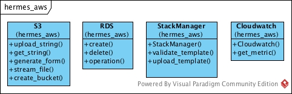
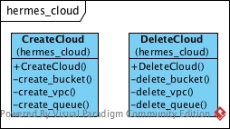
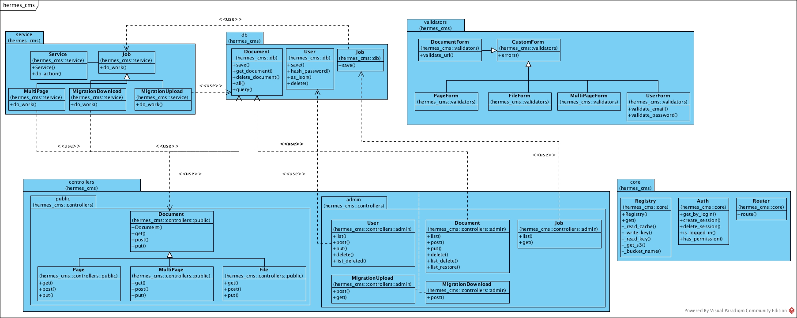
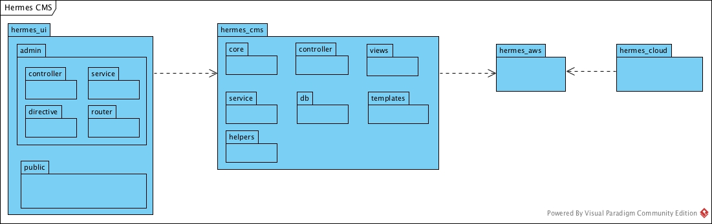
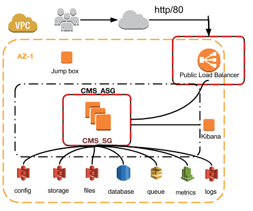

\newpage

# Architecture

This document describes the high level architecture of Hermes CMS.

## Architectural Goals

The main architectural goals of the Hermes CMS are to be configurable, scalable, easily upgradable, and robust. 

## System Architecture

In the next few sections an overview of the System architecture is shown such as Classes, Packages and the deployment of the system.

### Classes

Below are the main classes that make up the Hermes system.

#### AWS

\newpage

#### Cloud

#### CMS

\newpage

### Packages

Each package below produces an RPM artefact which is uploaded into a YUM repository and later used within the creation of an Amazon Image (AMI) using packer.

\newpage

### Deployment

\newpage

## Project Structure

This document explains the project folder structure

### Packages
The system creates 4 packages in the form of an RPM. 

- hermes_aws
- hermes_cms
- hermes_cloud
- hermes_ui

These packages are pushed into a custom YUM repository hosted in S3 and later used to install when creating an AMI.

### Directory Structure

The project is split into logical folder structure. Each part is briefly described below.

### baking

The baking folder contains all the packer and ansible configuration to create Amazon Images.

### ci

The ci folder contains all the scripts which run within ci. These scripts are written that they can be run locally without the requirement of a Continuous Integration system such as Jenkins being used.

### docs

Contains markdown files for the documentation of the entire system.

### hermes_aws

Common AWS calls which the system requires.

### hermes_cloud

Contains all the scripts and templates required to build a functioning Hermes CMS cloud system.

### hermes_cms

Contains all the CMS code such as Documents, Authentication and services

### hermes_ui

Contains all the CMS code for the User Interface (UI).

### scripts

Some helper scripts for developing locally such as a local server, finding the host name of the cloud created, and SSHing to a particular resource within the Cloud environment.

### tests

Contains all the integration and end to end tests which are run for the system within Jenkins.
