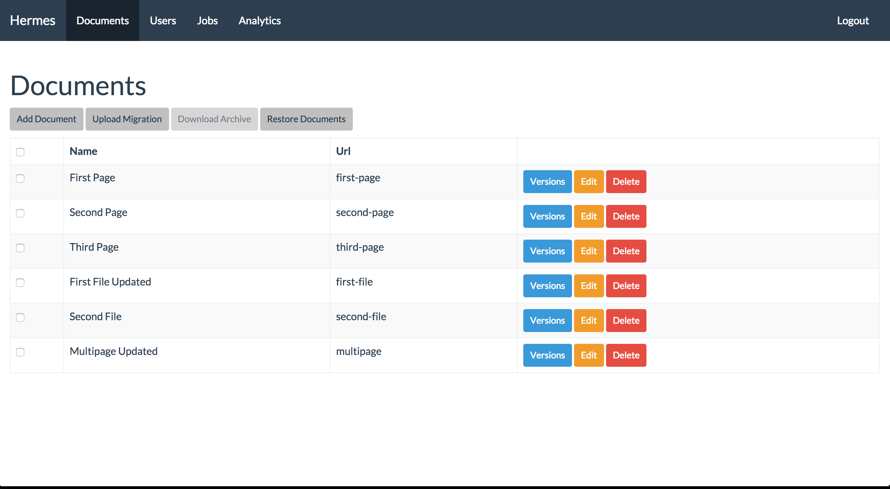
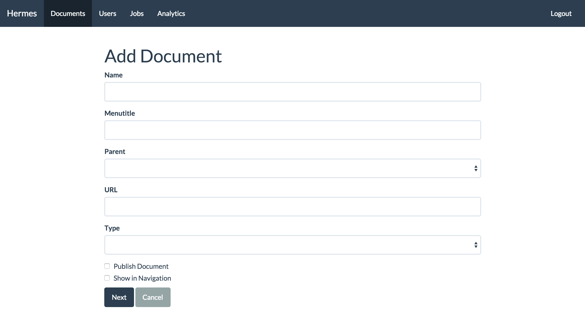
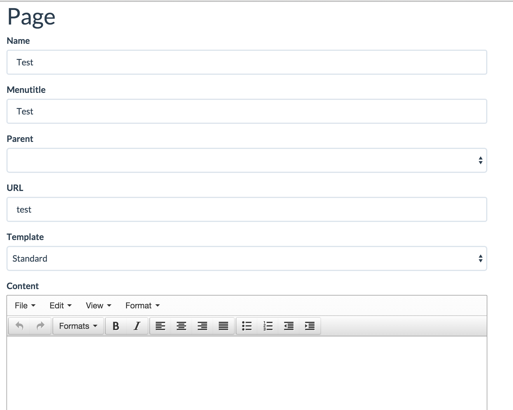
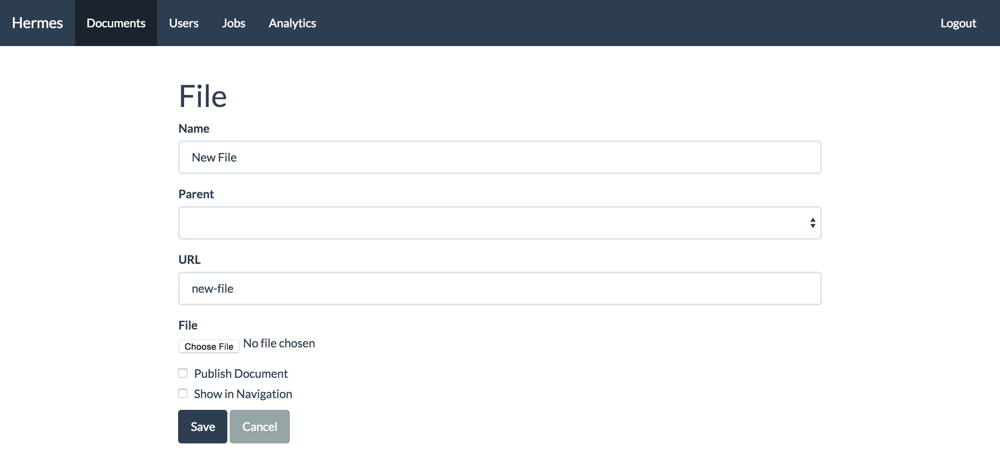
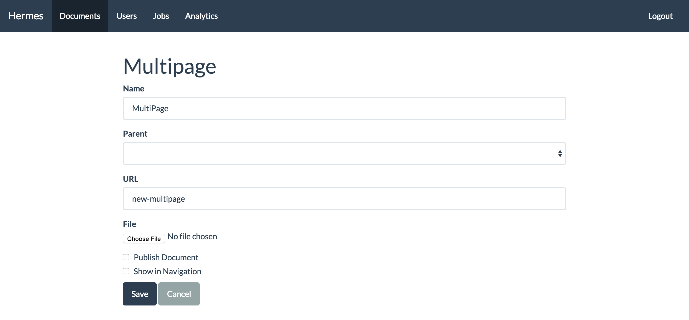
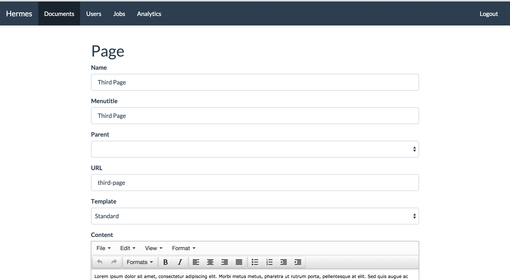
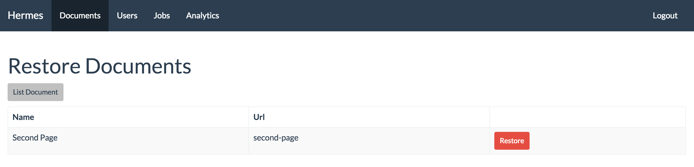
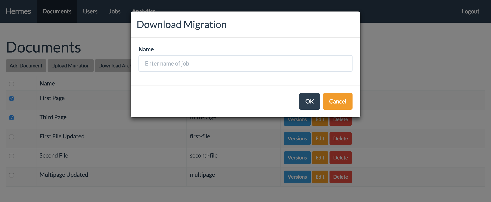
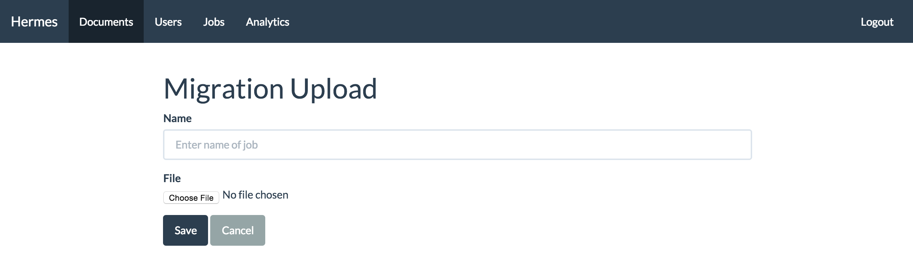

\newpage

# Documents

This section describes how to use documents within the Hermes Content Management System.

## What is a Document?

A document is a unique accessible via a URL within the Content Management System (CMS). Documents are versioned which allows versions to be restored.

\newpage

## Create a Page

In the Document List view, click on add Document.

1. Enter the name of the document
1. Enter the menu title, this is displayed in the navigation
1. If documents already exist the document being created can be a child to that existing document. Select the appropriate parent document.
1. Enter a unique URL. It must not start with / or end with a /
1. Select the Type of Page.
1. Select the template to use for this Page. Options are currently only Standard
1. Checking the Publish Document checkbox will ensure the document is available to the public.
1. Checking Show in Navigation will ensure the document is visible in the navigation.
1. Click next to continue finalise the document.

\newpage

10. Use the WYSIWYG Editor to enter the content for the page. If you know the link to existing documents you can link to these documents.

\newpage

## Create a File 

In the Document List view, click on add Document.

1. Enter the name of the document
1. Enter the menu title, this is displayed in the navigation
1. If documents already exist the document being created can be a child to that existing document. Select the appropriate parent document.
1. Enter a unique URL. It must not start with / or end with a /
1. Select the Type of File.
1. Checking the Publish Document checkbox will ensure the document is available to the public.
1. Checking Show in Navigation will ensure the document is visible in the navigation.
1. Click next to continue finalise the document.

\newpage

10. Click the Choose File or Browse button to select the file to be uploaded.

\newpage

## Create a MultiPage

In the Document List view, click on add Document.

1. Enter the name of the document
1. Enter the menu title, this is displayed in the navigation
1. If documents already exist the document being created can be a child to that existing document. Select the appropriate parent document.
1. Enter a unique URL. It must not start with / or end with a /
1. Select the Type of MultiPage.
1. Checking the Publish Document checkbox will ensure the document is available to the public.
1. Checking Show in Navigation will ensure the document is visible in the navigation.
1. Click next to continue finalise the document.

\newpage

10. Click the Choose File or Browse button to select the file to be uploaded. This file must be a ZIP file.

\newpage

## Modify Document

To modify a document find the document you want to modify and click the "Edit" button. You will be then shown the appropriate document

\newpage

All validation of fields apply when modifying a document.

\newpage

## Delete Document

To delete a document find the document you want to delete and click the "Delete" button. This will will remove the document from the list. See Restore Document to find out how to restore a document.

\newpage

## Restore Document

Click on the Document Restore button.

Find the document to restore and click Restore. Once clicked the document will be restored and will be visible on the Document List.

\newpage

## Restore Version Document

Find the document you need to restore a particular version 

\newpage

## Download Archive

In the above Figure there are checkboxes which can be checked to mark documents to be part of the Download ZIP Archive. If a document has children these pages will automatically be added to the ZIP. When ready to create the Download ZIP archive a modal will be displayed so you can name the Archive. This name is used as the name on the Job list page so you can track the job. When ready you can download from the Job page.

\newpage

## Upload Migration Archive

To upload a migration archive to the system. You will need to ensure you have first downloaded an archive. On the download list page click on the "Upload Migration" button

You will need to ensure that you upload the correct ZIP archive. When the ZIP file is uploaded a Job is created (See Jobs) where you can track the upload. An invalid Migration archive will fail.

\newpage

## View Document

Documents are available publicly, by going to e.g. [http://hermescms.paulmcilwaine.com/](http://hermescms.paulmcilwaine.com/) and entering a valid path after the domain
