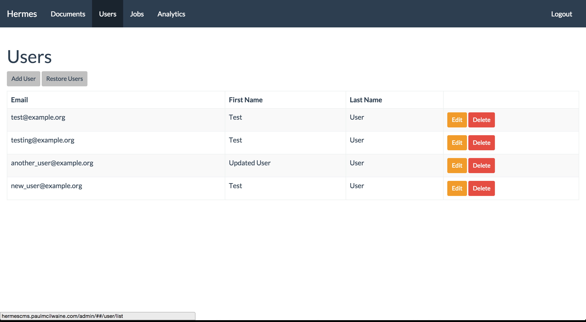
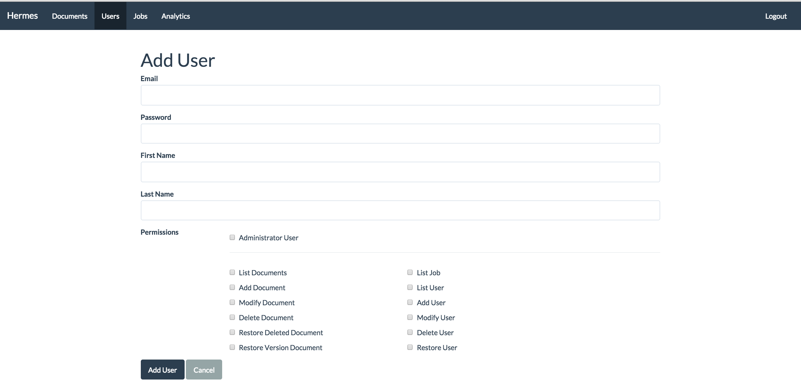
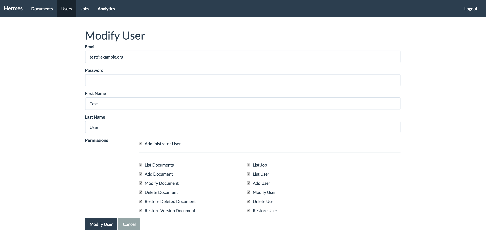
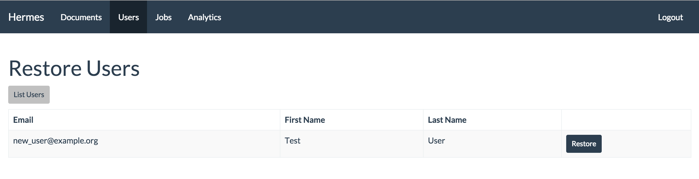

\newpage

# User

Users are created to allow access to the administration section of the Hermes CMS.

\newpage

## Add User

1. Click Add User see Figure "User List"
1. Enter a valid email address that is unique in the system.
1. Enter a password for the user
1. Enter the users first name, this field is optional
1. Enter the users last name, this field is optional
1. Clicking Administrator User for permissions will check all available permissions.
1. Clicking on individual permissions will give the user particular permissions within the system.

\newpage

## Modify User

1. Click edit button for the User that needs to be modified. see Figure "User List"
1. The user being edited details are shown in the User Form.
1. The email address can optionally be changed. If it is changed it must be unique
1. The password can optionally be changed.
1. Enter the users first name, this field is optional
1. Enter the users last name, this field is optional
1. Clicking Administrator User for permissions will check all available permissions.
1. Clicking on individual permissions will give the user particular permissions within the system.

\newpage

## Delete User

1. If the user has permission when clicking the Delete for a user to delete the user will be removed.
1. If the user does not have permission to delete a user, an error message is displayed.

\newpage

## Restore User

If a user has been deleted they are unable to login, however they can be restored into the system. See the Figure. User List and click on Restore User.

A list of users to restore shown in Figure. User Restore can be restored by clicking on Restore.
