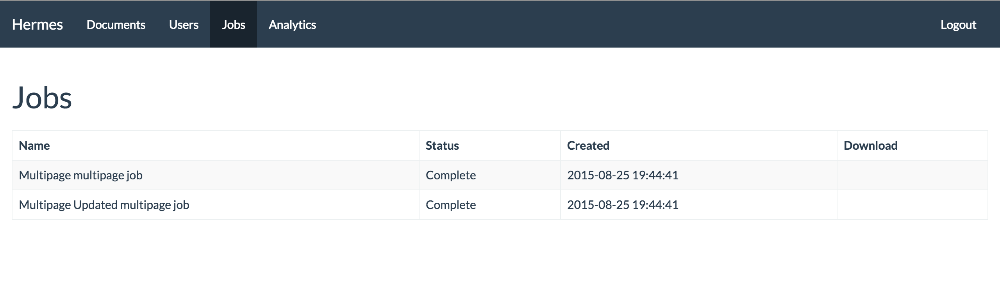

\newpage

# Jobs

The Job page displays in descending order (latest to oldest) jobs that have executed, running or waiting to be run.

Jobs take the following states.

- Pending - The job has not run yet.
- Running - The job is currently running.
- Complete - The job is completed successful
- Failed - The job has failed. You will need redo the job to attempt to have the job complete.
