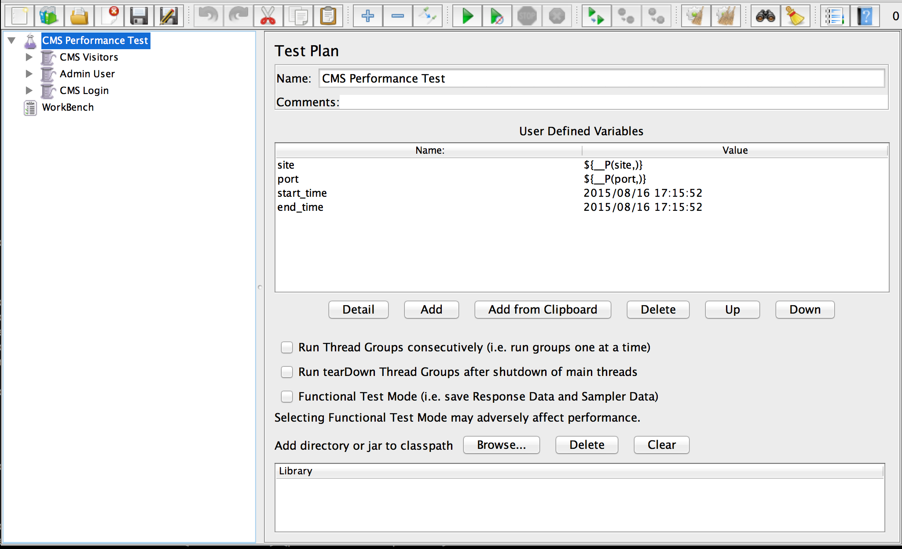

\newpage

# Performance Testing

You will need to download the performance test from [https://s3-ap-southeast-2.amazonaws.com/tests-paulmcilwaine-com/performance-test.jmx](https://s3-ap-southeast-2.amazonaws.com/tests-paulmcilwaine-com/performance-test.jmx) and download JMeter from [http://jmeter.apache.org/download_jmeter.cgi](http://jmeter.apache.org/download_jmeter.cgi)

When opened you'll get the above screen displayed (ensure that you open the download jmeter performance test file). The following values will need to be changed to ensure the test works.

+---------+-----------------------------------------+
| Name    | Value                                   |
+=========+=========================================+
| site    | http://hermescms.paulmcilwaine.com      |
+---------+-----------------------------------------+
| port    | 80                                      |
+---------+-----------------------------------------+

Then click the play button. The test will take ~15 mins to run. To see a new instance loaded you'll need to periodically refresh the Analytics page in the administration.
